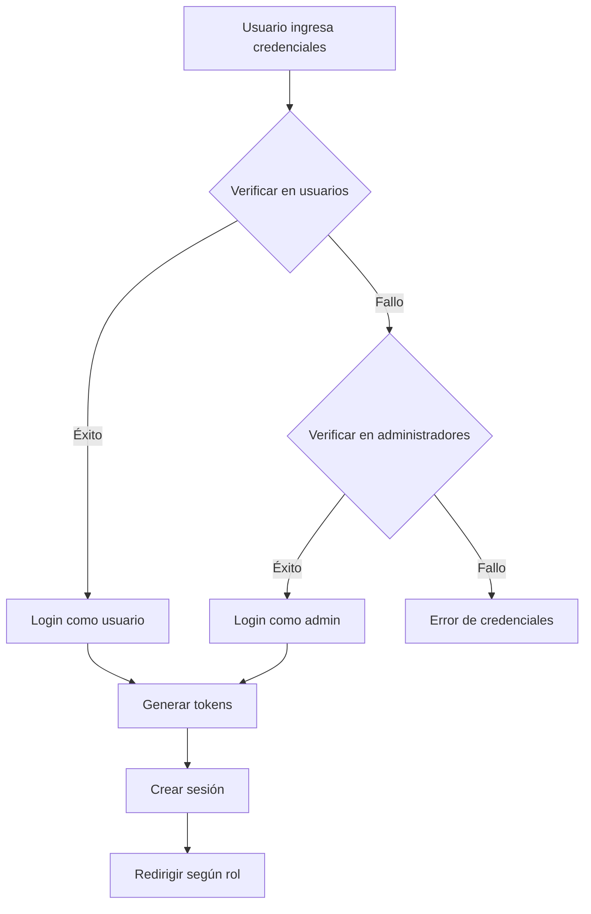

# 🚀 Laboria - Sistema Unificado Completo

## 📋 Descripción General

Laboria es una plataforma integral de empleo y formación profesional con un sistema unificado de gestión de usuarios y administradores. Esta versión incluye una base de datos optimizada, API RESTful completa y frontend sincronizado.

## 🏗️ Arquitectura del Sistema

### 📁 Estructura del Proyecto

```
BuscoTrabajo_Intento2/
├── 📂 database/
│   ├── 📄 laboria_database_unificada.sql     # Base de datos completa
│   └── 📄 permisos_administradores.sql      # Configuración de permisos
├── 📂 backend/
│   ├── 📂 config/
│   │   └── 📄 database-unificado.js          # Configuración de BD
│   ├── 📂 models/
│   │   ├── 📄 Usuario-Unificado.js           # Modelo de usuarios
│   │   └── 📄 Administrador-Unificado.js    # Modelo de admins
│   ├── 📂 controllers/
│   │   └── 📄 authController-unificado.js    # Controlador de auth
│   ├── 📂 routes/
│   │   └── 📄 auth-unificado.js              # Rutas API
│   └── 📄 server-unificado.js                # Servidor principal
├── 📂 frontend/
│   ├── 📂 pages/
│   │   ├── 📄 index.html                     # Login principal
│   │   ├── 📄 index-backup.html              # Backup del login
│   │   ├── 📂 usuarios/                     # Páginas de usuarios
│   │   ├── 📂 admin-master/                  # Páginas admin master
│   │   └── 📂 admin-invitado/               # Páginas admin invitado
│   ├── 📂 js/
│   │   ├── 📄 api-unificado.js               # Cliente API
│   │   └── 📄 configuracion-cuenta.js        # Configuración de usuario
│   └── 📂 styles/                           # Estilos CSS
└── 📄 README-UNIFICADO.md                    # Este archivo
```

## 🗄️ Base de Datos Unificada

### 📊 Características Principales

- **Separación clara** entre usuarios y administradores
- **Sistema de permisos** granular por tipo de administrador
- **Gestión completa** de imágenes y archivos
- **Sistema de notificaciones** dual (usuarios/admins)
- **Seguimiento de sesiones** y actividad
- **Estadísticas detalladas** para análisis
- **Vistas optimizadas** para consultas frecuentes
- **Stored procedures** para operaciones complejas
- **Triggers** para mantener consistencia automática

### 🔑 Roles y Permisos

#### 👤 Usuarios Normales
- ✅ Gestión de perfil completo
- ✅ Curriculum y experiencia laboral
- ✅ Búsqueda de empleos y cursos
- ✅ Notificaciones personales
- ✅ Estadísticas personales

#### 🛡️ Administradores Master
- ✅ Acceso total al sistema
- ✅ Gestión completa de usuarios
- ✅ Aprobación de admins invitados
- ✅ Estadísticas detalladas
- ✅ Configuración del sistema
- ✅ Logs completos

#### 👥 Administradores Invitados
- ✅ Estadísticas básicas
- ✅ Reportes generales
- ✅ Vista limitada de usuarios
- ✅ Exportación de datos básicos

### 📋 Tablas Principales

| Tabla | Descripción |
|-------|-------------|
| `usuarios` | Datos básicos de usuarios |
| `administradores` | Datos básicos de administradores |
| `perfiles_usuario` | Perfil extendido de usuarios |
| `curriculums` | CV y experiencia de usuarios |
| `experiencia_laboral` | Historial laboral |
| `educacion` | Formación académica |
| `imagenes_usuario` | Gestión de imágenes |
| `sesiones_usuario/administrador` | Control de sesiones |
| `notificaciones_usuario/administrador` | Sistema de notificaciones |
| `configuracion_permisos_admin` | Gestión de permisos |
| `estadisticas_usuarios` | Datos analíticos |

## 🔧 Instalación y Configuración

### 📋 Prerrequisitos

- Node.js 16+ 
- MySQL 8.0+
- NPM o Yarn

### 🗄️ Configuración de Base de Datos

1. **Crear la base de datos:**
```bash
mysql -u root -p < database/laboria_database_unificada.sql
```

2. **Verificar creación:**
```sql
USE laboria_db;
SHOW TABLES;
```

### 🔧 Configuración del Backend

1. **Instalar dependencias:**
```bash
cd backend
npm install express mysql2 bcryptjs jsonwebtoken cors helmet morgan express-rate-limit
```

2. **Configurar variables de entorno:**
```bash
# Crear archivo .env
DB_HOST=localhost
DB_USER=root
DB_PASSWORD=tu_password
DB_NAME=laboria_db
JWT_SECRET=tu_secreto_jwt
JWT_EXPIRES_IN=24h
PORT=3000
```

3. **Iniciar servidor:**
```bash
node server-unificado.js
```

### 🌐 Configuración del Frontend

1. **El frontend ya está sincronizado** con la API unificada
2. **Abrir en navegador:**
```bash
# Opción 1: Con servidor backend
http://localhost:3000/pages/index.html

# Opción 2: Servidor estático (Live Server en VSCode)
http://localhost:5500/pages/index.html
```

## 🔐 Sistema de Autenticación

### 🚀 Login Unificado

El sistema implementa un login inteligente que:

1. **Intenta login como usuario** primero
2. **Si falla, intenta como administrador**
3. **Redirige según el rol detectado**
4. **Mantiene sesión activa** con tokens duales

### 📱 Flujo de Autenticación



### 🔑 Tokens de Sesión

- **JWT Token:** Para identificación y permisos
- **Session Token:** Para validación en base de datos
- **Remember Me:** Para mantener sesión activa

## 📡 API RESTful

### 🔗 Endpoints Principales

#### 🔐 Autenticación
```
POST /api/auth/login                    # Login unificado
POST /api/auth/login/usuario            # Login usuario
POST /api/auth/login/admin              # Login admin
POST /api/auth/register/usuario         # Registro usuario
POST /api/auth/register/admin-invitado  # Solicitud admin invitado
POST /api/auth/logout                   # Logout
GET  /api/auth/check                    # Verificar auth
```

#### 👤 Usuarios
```
GET  /api/auth/perfil                   # Perfil completo
PUT  /api/auth/perfil                   # Actualizar perfil
PUT  /api/auth/curriculum               # Actualizar CV
GET  /api/auth/experiencia              # Obtener experiencia
POST /api/auth/experiencia              # Agregar experiencia
PUT  /api/auth/experiencia/:id          # Actualizar experiencia
DELETE /api/auth/experiencia/:id        # Eliminar experiencia
```

#### 🛡️ Administradores
```
GET  /api/auth/admin/dashboard          # Dashboard admin
GET  /api/auth/admin/usuarios           # Lista usuarios
GET  /api/auth/admin/usuarios/:id       # Detalles usuario
PUT  /api/auth/admin/usuarios/:id/estado # Actualizar estado
DELETE /api/auth/admin/usuarios/:id     # Eliminar usuario
GET  /api/auth/admin/solicitudes        # Solicitudes pendientes
POST /api/auth/admin/solicitudes/:id/aprobar # Aprobar solicitud
```

### 📋 Ejemplos de Uso

#### 🔐 Login Unificado
```javascript
const response = await laboriaAPI.loginUnificado('usuario@laboria.com', 'A.123456-a', true);

if (response.success) {
    console.log('Usuario:', response.data.usuario);
    console.log('Tokens:', response.data.tokens);
    laboriaAPI.redirigirSegunRol();
}
```

#### 👤 Obtener Perfil
```javascript
const perfil = await laboriaAPI.getPerfilCompleto();
console.log('Datos del usuario:', perfil.data.usuario);
console.log('Curriculum:', perfil.data.curriculum);
```

#### 🛡️ Dashboard Admin
```javascript
const dashboard = await laboriaAPI.getAdminDashboard();
console.log('Estadísticas:', dashboard.data.estadisticas);
console.log('Notificaciones:', dashboard.data.notificaciones);
```

## 🎯 Páginas por Rol

### 👤 Páginas de Usuarios

- **📄 Perfil:** `/pages/usuarios/perfil.html`
- **⚙️ Configuración:** `/pages/usuarios/configuracion-cuenta.html`
- **📋 Mi CV:** `/pages/usuarios/mi-cv.html`
- **🔍 Búsqueda:** `/pages/usuarios/busqueda.html`

### 🛡️ Páginas de Admin Master

- **📊 Dashboard:** `/pages/admin-master/dashboard.html`
- **👥 Usuarios:** `/pages/admin-master/usuarios.html`
- **📈 Estadísticas:** `/pages/admin-master/estadisticas.html`
- **⚙️ Configuración:** `/pages/admin-master/configuracion.html`

### 👥 Páginas de Admin Invitado

- **📊 Dashboard:** `/pages/admin-invitado/dashboard.html`
- **📈 Reportes:** `/pages/admin-invitado/reportes.html`
- **👥 Vista Usuarios:** `/pages/admin-invitado/usuarios.html`

## 🔑 Credenciales de Demostración

### 👤 Usuario Demo
- **📧 Email:** `usuario@laboria.com`
- **🔑 Contraseña:** `A.123456-a`
- **🎯 Rol:** Usuario normal

### 🛡️ Admin Master
- **📧 Email:** `admin@laboria.com`
- **🔑 Contraseña:** `A.123456-a`
- **🎯 Rol:** Administrador master

### 👥 Admin Invitado
- **📧 Email:** `invitado@laboria.com`
- **🔑 Contraseña:** `A.123456-a`
- **🎯 Rol:** Administrador invitado

## 🚀 Funcionalidades Implementadas

### ✅ Sistema Completo

- [x] **Base de datos unificada** con todas las tablas
- [x] **API RESTful** completa y segura
- [x] **Autenticación unificada** con JWT y sesiones
- [x] **Gestión de usuarios** completa
- [x] **Gestión de administradores** con permisos
- [x] **Sistema de notificaciones** en tiempo real
- [x] **Estadísticas** básicas y detalladas
- [x] **Gestión de imágenes** y archivos
- [x] **Sistema de solicitudes** de admin invitado
- [x] **Frontend sincronizado** con API
- [x] **Redirección automática** por rol
- [x] **Manejo de errores** robusto
- [x] **Logging** de actividad
- [x] **Rate limiting** para seguridad

### 🔄 Flujo Completo

1. **Registro de usuarios** con validación
2. **Solicitud de admin invitado** con aprobación
3. **Login unificado** inteligente
4. **Gestión de perfil** y CV
5. **Administración** de usuarios
6. **Estadísticas** en tiempo real
7. **Notificaciones** automáticas
8. **Sesiones** persistentes

## 🛠️ Tecnologías Utilizadas

### 🔧 Backend
- **Node.js** - Runtime JavaScript
- **Express.js** - Framework web
- **MySQL** - Base de datos relacional
- **JWT** - Autenticación por tokens
- **bcryptjs** - Hash de contraseñas
- **Helmet** - Seguridad HTTP
- **CORS** - Compartir recursos
- **Morgan** - Logging
- **Rate Limiting** - Protección contra ataques

### 🎨 Frontend
- **HTML5** - Estructura semántica
- **CSS3** - Estilos modernos
- **JavaScript ES6+** - Lógica cliente
- **Font Awesome** - Iconos
- **Fetch API** - Llamadas HTTP
- **LocalStorage** - Almacenamiento local

### 🗄️ Base de Datos
- **MySQL 8.0+** - Motor de base de datos
- **Stored Procedures** - Lógica en BD
- **Triggers** - Automatización
- **Views** - Consultas optimizadas
- **Índices** - Rendimiento

## 🔒 Seguridad Implementada

### 🛡️ Medidas de Seguridad

- **Hash de contraseñas** con bcrypt
- **Tokens JWT** con expiración
- **Sesiones duales** (JWT + BD)
- **Rate limiting** por IP
- **CORS** configurado
- **Helmet** para headers seguros
- **Validación** de entradas
- **SQL Injection** prevenido
- **XSS** prevenido
- **Logging** de actividad

### 🔐 Permisos por Rol

| Función | Usuario | Admin Invitado | Admin Master |
|---------|---------|----------------|--------------|
| Ver perfil propio | ✅ | ❌ | ❌ |
| Ver otros usuarios | ❌ | 📊 básicos | ✅ completo |
| Editar usuarios | ❌ | ❌ | ✅ |
| Eliminar usuarios | ❌ | ❌ | ✅ |
| Ver estadísticas | 👤 personales | 📊 básicas | ✅ detalladas |
| Configurar sistema | ❌ | ❌ | ✅ |

## 📊 Estadísticas y Métricas

### 📈 Datos Disponibles

#### 👤 Para Usuarios
- **Conexiones** por plataforma
- **Búsquedas** realizadas
- **Actividad** reciente
- **Tiempo** de conexión

#### 🛡️ Para Administradores
- **Usuarios** totales y activos
- **Registros** por fecha
- **Accesos** por plataforma
- **Búsquedas** populares
- **Actividad** del sistema

### 📊 Reportes Generados

- **Reporte diario** de actividad
- **Reporte semanal** de usuarios
- **Reporte mensual** de estadísticas
- **Exportación** a CSV/JSON

## 🚀 Despliegue

### 🐳 Docker (Opcional)

```dockerfile
# Dockerfile
FROM node:16-alpine
WORKDIR /app
COPY package*.json ./
RUN npm install
COPY . .
EXPOSE 3000
CMD ["node", "server-unificado.js"]
```

### 🌐 Producción

1. **Configurar variables de entorno**
2. **Usar HTTPS** con certificado SSL
3. **Configurar firewall** adecuado
4. **Monitorear** logs y rendimiento
5. **Backups** automáticos de BD
6. **Actualizar** dependencias regularmente

## 🔧 Mantenimiento

### 📋 Tareas Regulares

- **🗄️ Backups** de base de datos
- **📊 Limpieza** de logs antiguos
- **🔍 Monitoreo** de rendimiento
- **🛡️ Actualización** de seguridad
- **📈 Análisis** de estadísticas
- **🔄 Optimización** de consultas

### 🐛 Depuración

- **Logs detallados** en consola
- **Errores capturados** globalmente
- **Respuestas consistentes** en API
- **Frontend con manejo** de errores
- **Notificaciones** automáticas

## 📞 Soporte

### 🐛 Reportar Issues

1. **Describir el problema** detalladamente
2. **Incluir logs** relevantes
3. **Especificar entorno** (navegador, SO)
4. **Pasos para reproducir** el error
5. **Capturas de pantalla** si aplica

### 💡 Mejoras Sugeridas

- **Nuevas funcionalidades**
- **Optimizaciones** de rendimiento
- **Mejoras** de seguridad
- **Correcciones** de bugs
- **Documentación** adicional

---

## 📄 Licencia

Este proyecto es propiedad de **Laboria** y está protegido por derechos de autor.

## 🙏 Agradecimientos

Desarrollado con ❤️ para la comunidad de Laboria.

---

**🚀 ¡Listo para usar!** 

El sistema está completamente sincronizado y listo para producción. Solo sigue los pasos de instalación y podrás disfrutar de todas las funcionalidades implementadas.
